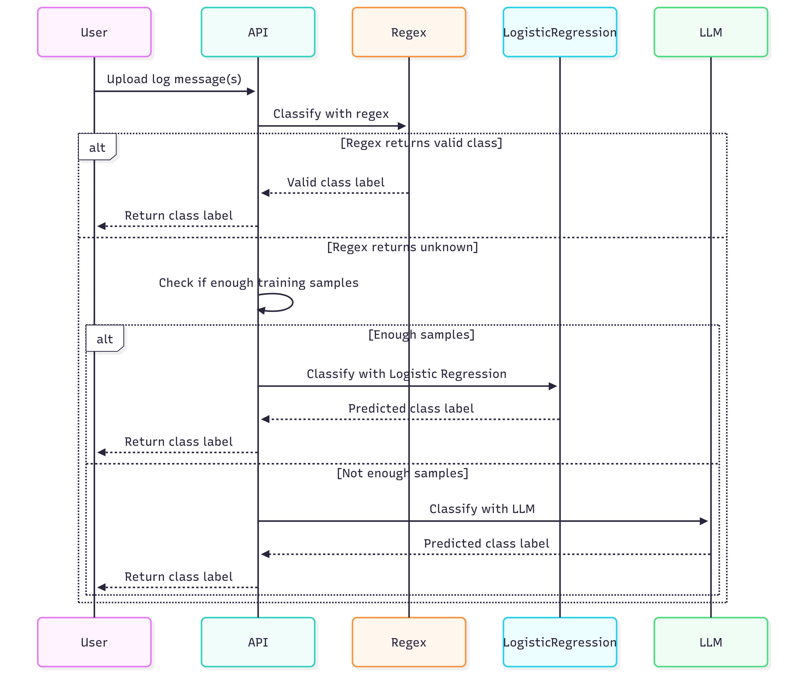

# Log Classification With Hybrid Classification Framework

This project is a full-stack application for classifying log files using NLP techniques. It consists of a FastAPI backend and a React frontend.

## Classification Approaches

1. **Regular Expression (Regex)**:

   - Handles the most simplified and predictable patterns.
   - Useful for patterns that are easily captured using predefined rules.

2. **Sentence Transformer + Logistic Regression**:

   - Manages complex patterns when there is sufficient training data.
   - Utilizes embeddings generated by Sentence Transformers and applies Logistic Regression as the classification layer.

3. **LLM (Large Language Models)**:
   - Used for handling complex patterns when sufficient labeled training data is not available.
   - Provides a fallback or complementary approach to the other methods.



---

## Features

- Upload a CSV file containing logs
- Classify logs using various NLP models
- Download the classified results
- Option to regenerate the report if not satisfied

---

## Prerequisites

- Python 3.10+
- Node.js 18+
- npm (comes with Node.js)

---

## Backend Setup

1. **Navigate to the backend folder:**
   ```sh
   cd backend
   ```
2. **Create a virtual environment (optional but recommended):**
   ```sh
   python -m venv venv
   venv\Scripts\activate  # On Windows
   # source venv/bin/activate  # On Mac/Linux
   ```
3. **Install Python dependencies:**
   ```sh
   pip install -r requirements.txt
   ```
4. **Run the FastAPI server:**
   ```sh
   uvicorn server:app --reload
   ```
   The backend will be available at `http://127.0.0.1:8000`.

---

## Frontend Setup

1. **Navigate to the frontend folder:**
   ```sh
   cd forntend
   ```
2. **Install Node.js dependencies:**
   ```sh
   npm install
   ```
3. **Run the React development server:**
   ```sh
   npm run dev
   ```
   The frontend will be available at `http://localhost:5173`.

---

## Usage

1. Open the frontend in your browser: [http://localhost:5173](http://localhost:5173)
2. Upload your CSV log file.
3. View and review the classification results.
4. Download the report or regenerate if needed.

---

## Project Structure

```
backend/      # FastAPI backend
forntend/     # React frontend (Vite)
```

---

## Notes

- Ensure the backend is running before using the frontend.
- The backend expects CSV files with `source` and `log_message` columns.
- The classified report will be available for download after processing.

---

## License

MIT
